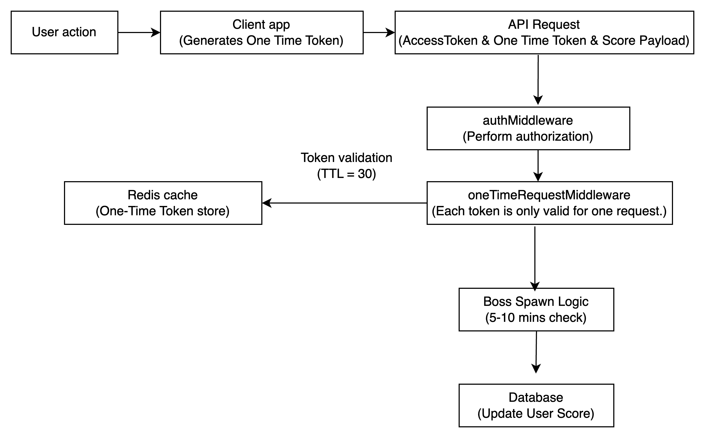

# Problem 4: Three ways to sum to n

This document compares three methods for computing the sum of the first `n` integers.

---

## Method 1: Using a Loop (Iterative Approach)

```typescript
function sum_to_n_a(n: number): number {
  let sum = 0; // Initialize the sum variable to store the result
  for (let i = 1; i <= n; i++) {
    // Iterate from 1 to n
    sum += i; // Add the current value of i to the sum
  }
  return sum; // Return the computed sum
}
```

### Explanation:
- **Time complexity:** `O(n)` - The loop iterates `n` times.
- **Space complexity:** `O(1)` - Uses a constant amount of memory.

---

## Method 2: Using a Mathematical Formula

```typescript
function sum_to_n_b(n: number): number {
  return (n * (n + 1)) / 2; // Calculate the sum using the formula for the sum of the first n integers
}
```

### Explanation:
- **Time complexity:** `O(1)` - The formula computes the sum in constant time.
- **Space complexity:** `O(1)` - No additional memory is used beyond the return value.

---

## Method 3: Using Recursion (Recursive Approach)

```typescript
function sum_to_n_c(n: number): number {
  if (n === 1) return 1; // Base case: the sum of the first integer is the integer itself
  return n + sum_to_n_c(n - 1); // Recursive step: add n to the sum of integers up to (n-1)
}
```

### Explanation:
- **Time complexity:** `O(n)` - There are `n` recursive calls.
- **Space complexity:** `O(n)` - Each recursive call adds a new frame to the call stack.

---

## Which Method is Best?

- **Use Mathematical Formula (Method 2):** Whenever performance and efficiency are critical. It's the fastest and most resource-efficient approach.
- **Use Iterative Method (Method 1):** If simplicity is a priority and you want to avoid potential issues with floating-point precision.
- **Use Recursive Method (Method 3):** For academic purposes or small values of `n`. Avoid for large inputs due to the risk of stack overflow.

### Special Considerations:
- If `n` is very large, both the Iterative and Recursive methods may struggle, making the Formula method the clear choice.


# Problem 5: A Crude Server

## Prerequisites

Before getting started, you need to install Docker on your machine. Please follow the steps below to install Docker:

- **Install Docker**: You can download and install Docker from the official website: [Download Docker](https://www.docker.com/get-started)

## Instructions

### Step 1: Install Docker

If you haven't installed Docker yet, follow these steps:

1. Download Docker from [Docker Desktop](https://www.docker.com/get-started).
2. Follow the installation guide for your operating system (Windows, macOS, or Linux).

After installation, you can verify if Docker is working correctly by running the following command:

```bash
docker --version
```

If you see the Docker version information, Docker has been installed successfully.


### Step 2: Run the Server with Docker

1. Open a terminal and navigate to the `99tech-test` directory:

```bash
cd 99tech-test
```

2. Run the following command to start the server with Docker:

```bash
docker compose up -d
```

This command will use Docker Compose to start the application in detached mode.

### A Crude Server (Coupon Module)

The application is a basic server designed to manage coupons. The server will be up and running once the Docker Compose process completes.

An example `.env` file has been created and referenced in the `docker-compose.yml` file to help you run the project smoothly. Please ensure you review or modify it as necessary before starting the server.


# Problem 6: Architecture

## Overview
The Scoreboard Service is a backend module designed to manage user scores, authenticate score update requests, and ensure the integrity of the scoring system. It includes mechanisms to prevent unauthorized score updates and supports a live scoreboard displaying the top users.

---

## Features

1. **Token-Based Score Update**
   - Each request to update a score requires a unique, one-time-use token.
   - Tokens expire after 30 seconds and are validated using Redis to prevent reuse.

2. **Boss Spawn Mechanism**
   - Users can only update their score when a boss "appears" after a cooldown period of 5 to 10 minutes.
   - Upon score update, the next boss appearance is reset.

3. **Scalable Leaderboard**
   - Supports paginated retrieval of user rankings sorted by score.

4. **Data Integrity**
   - Passwords are hashed using bcrypt.
   - The user schema enforces strict validation for secure and consistent data.

---

## Mechanism to Prevent Unauthorized Score Updates

To ensure the security and integrity of the scoring system, the Scoreboard Service employs the following mechanisms:

### 1. **One-Time Token Authentication**
   - **Token Generation:**
     - Each user generates a one-time-use score token via the `/score-token` endpoint.
     - The token is a JWT signed with a secret key and has a lifespan of 30 seconds (`expiresIn: 30s`).
   - **Token Validation:**
     - Each request to update the score must include the token in the `x-one-time-token` header.
     - The server validates the token by:
       1. Verifying its authenticity and expiration using the secret key.
       2. Checking Redis to ensure the token hasn’t been used before.
   - **Redis Cache:**
     - Tokens are stored in Redis with a 30-second TTL.
     - If a token is already present in Redis, the request is rejected as invalid.

### 2. **Boss Spawn Timer Validation**
   - Users can only update their score when their "boss" is available.
   - The `bossAppearsAt` timestamp is stored in the database and indicates when the user is eligible to update their score.
   - If a user tries to update their score before the boss appears, the request is denied.

### 3. **Data Integrity in Score Updates**
   - The server verifies the score increment value sent in the request body to prevent invalid or excessive updates.
   - All score update operations are logged and monitored to detect unusual patterns.

### 4. **Rate Limiting and Abuse Detection**
   - Rate limits can be applied to the token generation endpoint to prevent token spamming.
   - IP-based monitoring tracks unusual activities, such as excessive requests from a single user.

---

## Architecture

### Flow Diagram
1. **Client Flow:**
    - Generate a one-time score token.
    - Send the token and score update request to the server.

2. **Server-Side Logic:**
    - Validate the token.
    - Check the boss appearance cooldown.
    - Update the score and reset the cooldown.

3. **Redis Caching:**
    - Tokens are stored with a TTL of 30 seconds to prevent reuse.

4. **Database Operations:**
    - Update user score and boss appearance timestamp.
    - Retrieve rankings with pagination.

### Diagram Illustration


## Middleware

### One-Time Request Middleware
- Validates one-time score tokens.
- Ensures tokens are not reused by checking Redis.
- Blocks requests with invalid or reused tokens.


## Improvements and Recommendations

1. **Documentation:**
   - Include detailed examples for API usage.
   - Provide a Swagger/OpenAPI spec for better integration with front-end clients.
